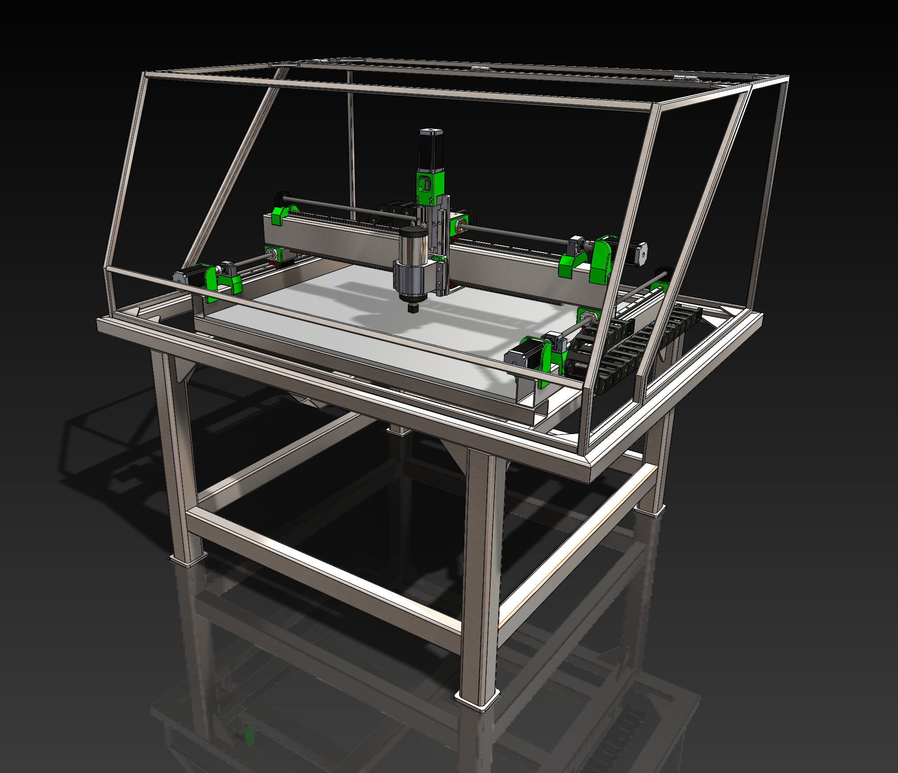
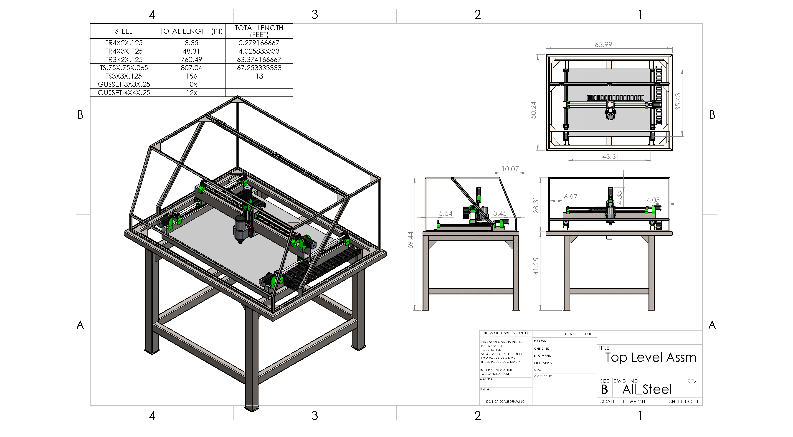
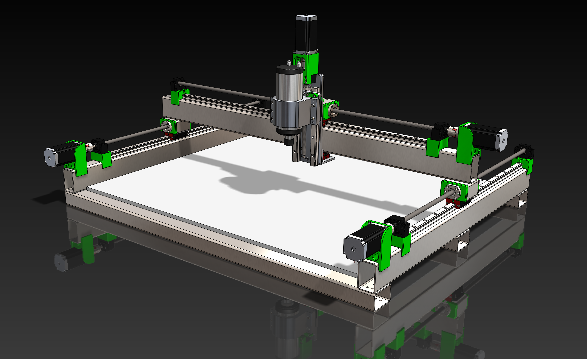
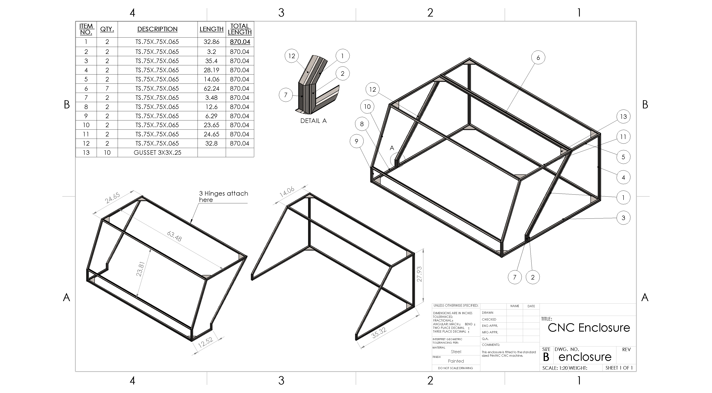
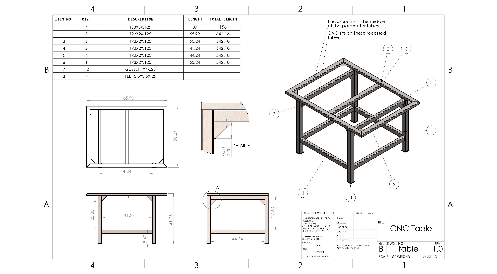
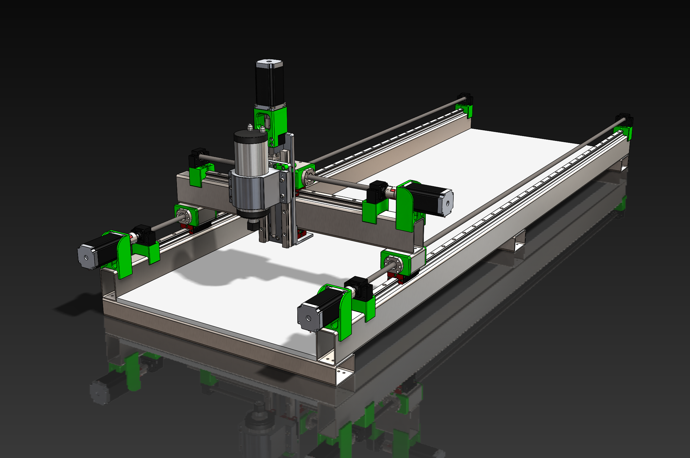
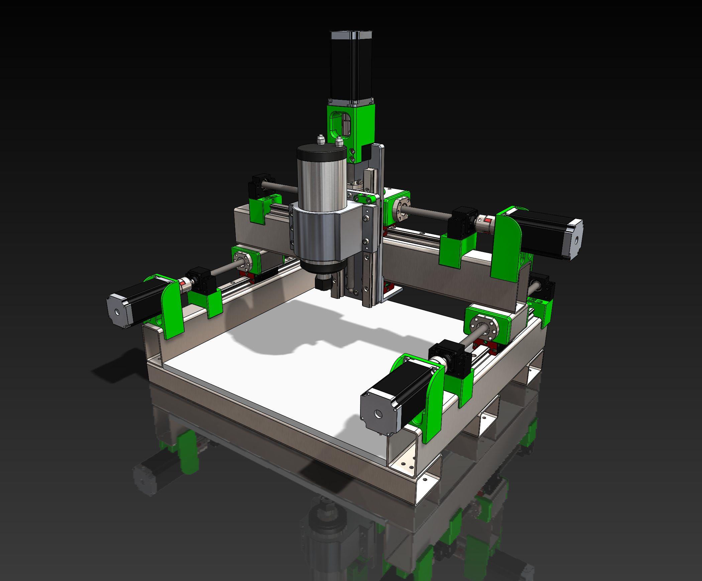

# PrintNC in Solidworks

For **FreeCAD** version see [PrintNC FreeCAD](https://github.com/bhowiebkr/PrintNC_FreeCAD)

This is the [PrintNC](https://github.com/threedesigns/printNC) design rebuilt in Solidworks from the original Fusion360 files. For more information on PrintNC see the [website](https://threedesign.store/) and the [wiki](https://wiki.printnc.info/en/home)

Because of the difficulty in keeping the solidworks files in line with the fusion 360 files, they will never be 1-to1. If you want to build a modified PrintNC and you know Solidworks, these files can be useful in designing your CNC machine. Otherwise you are much better off following the official [Fusion 360 files](https://wiki.printnc.info/en/project-files).

## Disclaimer
**WARNING** This is still very much a work-in-progress. I cannot guarantee that there are no part interference, hole alignment mismatch, etc. The design will get more refined over time, but as for now **USE AT YOUR OWN RISK!** If you are building the standard size make sure that your rails and ball screws are the correct length before you cut/order your structural steel. The files here are slightly shorter in the X-axis than the standard size [Aliexpress kit](http://s.click.aliexpress.com/e/3XmrR62y).

## Notes
- See [equations.txt](src/equations.txt) for hole tapping and clearence, width, height, steel dimensions used in the files.
- The main assembly is broken up into sub-assemblies. Each subassembly is defined by its motion axis. When complete there will be x, y, z axis and frame sub-assemblies under the main assembly.
- All steel tubes in the CNC machine, table, and enclosure have been converted to [Weldments](https://help.solidworks.com/2020/english/SolidWorks/sldworks/c_Weldments_Overview.htm). This is to have all the steel conform to a standard for the drawings. In turn this has made the [equations.txt](src/equations.txt) file for setting these values no longer work. If you want to change a tube size, it is best to do it in the part level and modify the weldment profile to the steel that you want to use. This will allow the configurations to properly update the drawing/pdf files. 

## Steel table and enclosure

## PrintNC standard size

## Drawings

## Paramizered sizes:

