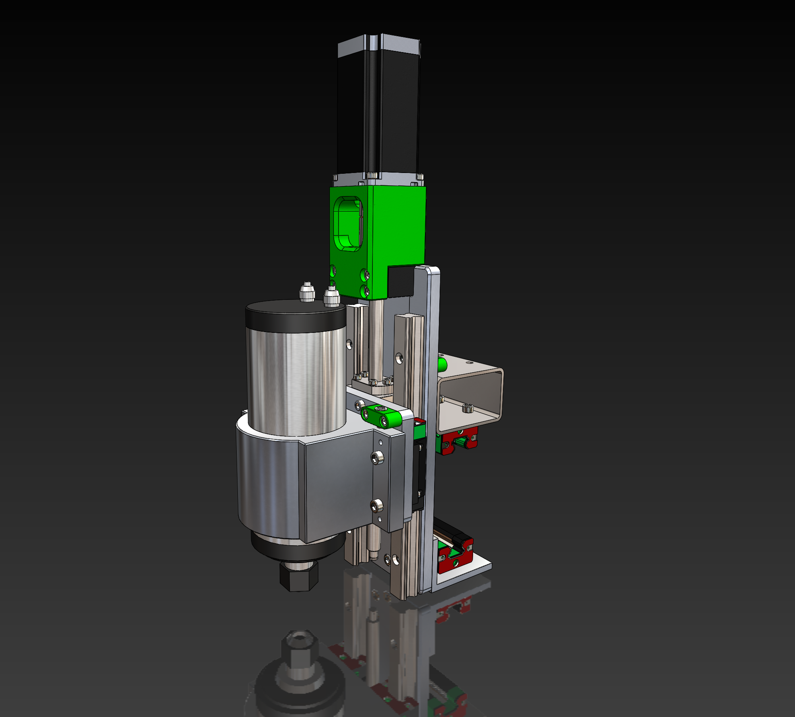

# PrintNC in Solidworks

This is the PrintNC design rebuilt in Solidworks from the original Fusion360 files. 

## Progress
I’ve just started out so not too much. I have the new V3 Z-axis mostly rebuilt. Starting to work on the gantry and base next from V2.X alpha.

**WARNING** This is still very much a work-in-progress. I cannot guarantee that there are no part interference, hole alignment mismatch, etc. I will be going over all of that after the initial complete design is finished.

## Notes
- See [equasions.txt](src/equations.txt) for hole tapping and clearence used in these files. This file gets linked to sketches when necessary.
- Where possible I keep similar parts as different configurations. eg metric bolt lengths, steel stock, etc. This cuts down on the number of part files.

